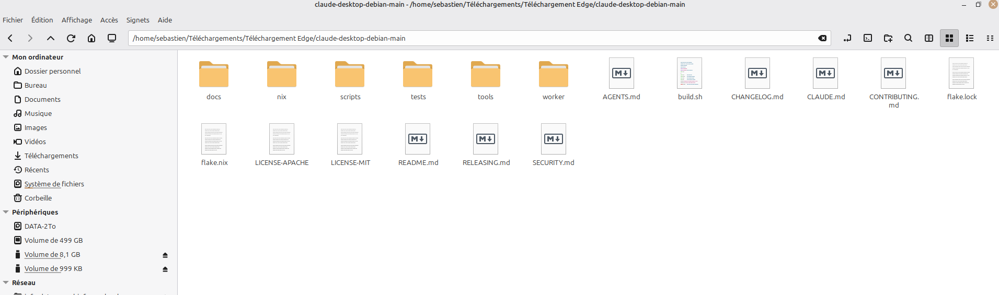

# Memo express - MCP Netdata (Runbook 1 page)

## Statut actuel

- Validation globale: GO
- Conteneur cible: 01_Node-20_MCP
- Watchdog timer: mcp-netdata-watchdog.timer (actif)
- Base URL Netdata (depuis conteneur): <http://172.17.0.1:19999>

## Commandes quotidiennes (80% des cas)

```bash
mcp-status
mcp-logs
mcp-logsf
mcp-restart
mcp-diag
```

## Build et lancement final

### Version recommandee la plus propre

```bash
cd /mnt/infradata/07_VSCode_Workspaces/03_Apprentissage_Sur_VSCode/mcp-netdata
chmod +x start-netdata-mcp.sh
./start-netdata-mcp.sh up
```

Commandes utiles:

```bash
./start-netdata-mcp.sh status
./start-netdata-mcp.sh logs
./start-netdata-mcp.sh health
./start-netdata-mcp.sh down
```

### Image Docker

```bash
cd /mnt/infradata/07_VSCode_Workspaces/03_Apprentissage_Sur_VSCode/mcp-netdata
docker build -t netdata-mcp:local .
```

### Lancement direct Docker

```bash
docker rm -f 01_Node-20_MCP 2>/dev/null || true
docker run -d -i \
  --name 01_Node-20_MCP \
  --restart=always \
  --user 1000:1000 \
  -e NETDATA_BASE_URL=http://172.17.0.1:19999 \
  --health-cmd="node /app/netdata-mcp.js --healthcheck" \
  --health-interval=30s \
  --health-timeout=10s \
  --health-retries=3 \
  -v /mnt/infradata/07_VSCode_Workspaces/03_Apprentissage_Sur_VSCode/mcp-netdata:/app \
  -w /app \
  node:20.11.0-bookworm \
  sh -c "node /app/netdata-mcp.js"
```

### Lancement via Compose

```bash
cd /mnt/infradata/07_VSCode_Workspaces/03_Apprentissage_Sur_VSCode/mcp-netdata
docker compose up -d --build
```

### Verification rapide

```bash
docker ps --filter name=01_Node-20_MCP
docker inspect 01_Node-20_MCP --format '{{.State.Health.Status}}'
docker exec -i 01_Node-20_MCP node /app/netdata-mcp.js --healthcheck
```

Note:

- En mode `stdio`, garder `-i` sur les commandes `docker exec` qui appellent directement le serveur MCP.

## Diag express (commande unique)

Commande:

```bash
set -o pipefail; FAIL=0; echo '=== DIAG MCP NETDATA EXPRESS ==='; echo '[1/4] Montage CIFS /mnt/infradata'; if mountpoint /mnt/infradata >/dev/null 2>&1; then echo 'OK - /mnt/infradata monte'; else echo 'KO - /mnt/infradata non monte'; FAIL=1; fi; echo '[2/4] Conteneur 01_Node-20_MCP'; if docker ps --format '{{.Names}}' | grep -qx '01_Node-20_MCP'; then echo 'OK - conteneur en cours'; else echo 'KO - conteneur arrete/absent'; FAIL=1; fi; echo '[3/4] Presence du script MCP dans le bind mount'; if docker exec 01_Node-20_MCP test -f /app/netdata-mcp.js; then echo 'OK - /app/netdata-mcp.js present'; else echo 'KO - /app/netdata-mcp.js absent'; FAIL=1; fi; echo '[4/4] Smoke test runtime MCP (3s max)'; timeout 3s docker exec -i 01_Node-20_MCP node /app/netdata-mcp.js </dev/null >/tmp/mcp_diag_out.log 2>/tmp/mcp_diag_err.log; EC=$?; if grep -q "Cannot find module '/app/netdata-mcp.js'" /tmp/mcp_diag_err.log; then echo 'KO - module introuvable dans le conteneur'; FAIL=1; elif [[ $EC -eq 0 || $EC -eq 124 ]]; then echo 'OK - runtime MCP demarre (exit='$EC')'; else echo 'KO - runtime MCP en erreur (exit='$EC')'; tail -n 20 /tmp/mcp_diag_err.log; FAIL=1; fi; if [[ $FAIL -eq 0 ]]; then echo 'RESULTAT GLOBAL: OK'; else echo 'RESULTAT GLOBAL: KO'; fi; exit $FAIL
```

Resultat attendu en nominal:

- `RESULTAT GLOBAL: OK`

## Commandes de controle

```bash
# Etat systemd
sudo systemctl status mcp-netdata-watchdog.timer --no-pager
sudo systemctl status mcp-netdata-watchdog.service --no-pager

# Etat conteneur
docker ps --filter 'name=01_Node-20_MCP'

# Bloc aliases charge
bash -ic "type mcp-start mcp-stop mcp-restart mcp-status mcp-logs mcp-logsf"
```

## Test fonctionnel Claude Desktop

Prompts de test:

- Prompt 1: Peux-tu appeler l'outil get_netdata_info et me renvoyer le JSON brut ?
- Prompt 2: Appelle get_cpu_snapshot et resume le resultat en 3 lignes.

Resultat attendu:

- get_netdata_info: JSON valide (ok: true)
- get_cpu_snapshot: reponse CPU exploitable (ok: true)

### Bloc de validation (attendu + observe)

#### Linux

Resultat attendu:

- get_netdata_info: reponse JSON brute valide, `ok: true`
- get_cpu_snapshot: reponse JSON valide, `ok: true`, resume en 3 lignes possible

Resultat observe:

- get_netdata_info: OK, JSON brut recu (version Netdata, OS Linux, RAM/disque, alarmes)
- get_cpu_snapshot: OK, donnees CPU exploitables (charge user/system/iowait lisible)
- Verdict Linux: GO

#### Win10

Resultat attendu:

- get_netdata_info: reponse JSON brute valide, `ok: true`
- get_cpu_snapshot: reponse JSON valide, `ok: true`, resume en 3 lignes possible

Resultat observe:

- get_netdata_info: A renseigner apres test Win10
- get_cpu_snapshot: A renseigner apres test Win10
- Verdict Win10: A renseigner (`GO` / `Partiel` / `KO`)

## Pannes frequentes et correction immediate

### 1) Erreur network_error avec localhost:19999

Symptome:

- get_netdata_info retourne ok: false

- url: <http://localhost:19999/>...

Correction:

- verifier ~/.config/Claude/claude_desktop_config.json
- dans mcpServers.netdata-mcp.args, injecter:
  - -e
  - NETDATA_BASE_URL=<http://172.17.0.1:19999>
- fermer puis relancer completement Claude Desktop

### 2) Alias introuvables

Cause:

- test effectue dans shell non interactif

Correction:

```bash
source ~/.bashrc
bash -ic "type mcp-status mcp-logs"
```

### 3) Timer actif, service inactif

Normal:

- service est en Type=oneshot
- il s'execute puis revient en inactive (dead)

### 4) Claude: "Server disconnected" / "Could not attach" + conteneur stoppe

Symptome:

- Claude affiche `MCP netdata-mcp: Server disconnected`
- `docker ps` ne montre pas `01_Node-20_MCP` en running
- `docker logs 01_Node-20_MCP` contient `Cannot find module '/app/netdata-mcp.js'`

Cause probable:

- le conteneur monte `/mnt/infradata/.../mcp-netdata:/app`
- `/mnt/infradata` n'est pas monte (CIFS KO), donc `/app` devient vide dans le conteneur

Verification rapide:

```bash
mountpoint /mnt/infradata
docker inspect 01_Node-20_MCP --format '{{json .HostConfig.Binds}}'
docker logs --tail 80 01_Node-20_MCP
```

Reprise immediate:

```bash
sudo mount -a
mountpoint /mnt/infradata
ls -la /mnt/infradata/07_VSCode_Workspaces/03_Apprentissage_Sur_VSCode/mcp-netdata
docker restart 01_Node-20_MCP
```

Si `sudo mount -a` renvoie `mount error(13): Permission denied`:

- verifier les credentials CIFS cotes NAS (identifiant/mot de passe)
- verifier que le partage `//sebinfranas.local/infradata` autorise cet utilisateur
- verifier les logs noyau juste apres l'echec: `sudo dmesg | tail -n 80`

Signature observee (diagnostic confirme):

- `CIFS: Status code returned 0xc000006d STATUS_LOGON_FAILURE`

Interpretation:

- authentification SMB refusee par le NAS (user/password/domain), pas un probleme DNS

Correction express:

1. mettre a jour `/etc/samba/credentials-sebinfra` avec le bon compte SMB du partage `infradata`
2. verifier les ACL/permissions de ce compte sur le NAS (lecture/ecriture du partage)
3. relancer: `sudo mount -a`
4. controler: `mountpoint /mnt/infradata`
5. relancer le conteneur MCP: `docker restart 01_Node-20_MCP`

## Fichiers de reference

- Setup fiable: mcp-netdata/setup_mcp_v2.sh
- Setup historique: mcp-netdata/setup_mcp.sh
- Guide complet: 05_Reprise_Projet_NetData/03_Installation_Claude_Desktop_Linux_Debian/04_Guide_Setup_MCP_Watchdog_Aliases.md
- Config Claude: ~/.config/Claude/claude_desktop_config.json
- Logs Claude MCP: ~/.config/Claude/logs/mcp-server-netdata-mcp.log

## Annexe capture (2026-06-07)

Capture archivee:



Analyse rapide:

- La capture montre l'explorateur Linux positionne sur un dossier source `claude-desktop-debian-main` dans `~/Telechargements`.
- Le contenu visible (`docs`, `nix`, `scripts`, `tests`, `worker`, `README.md`) correspond a une arborescence de code source/projet, pas a un package binaire installe.
- Cette capture confirme le contexte de travail local (fichiers de build/scripts presents) utile pour retracer l'origine des tests et manipulations lors du depannage MCP.

Point d'attention exploitation:

- Pour les diagnostics MCP, la source de verite reste la configuration utilisateur de l'app (`~/.config/Claude/claude_desktop_config.json`) et l'etat Docker/CIFS, pas le dossier source telecharge.
